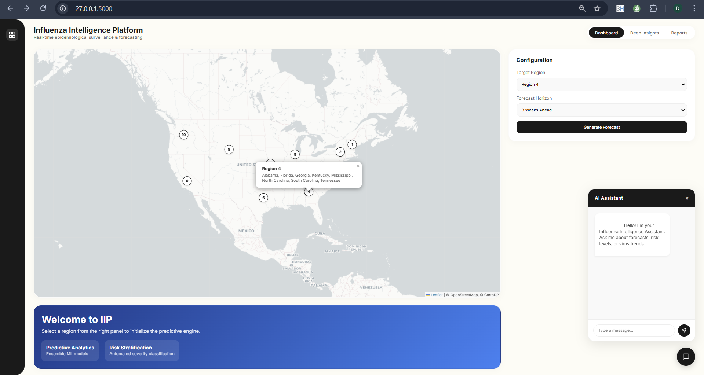
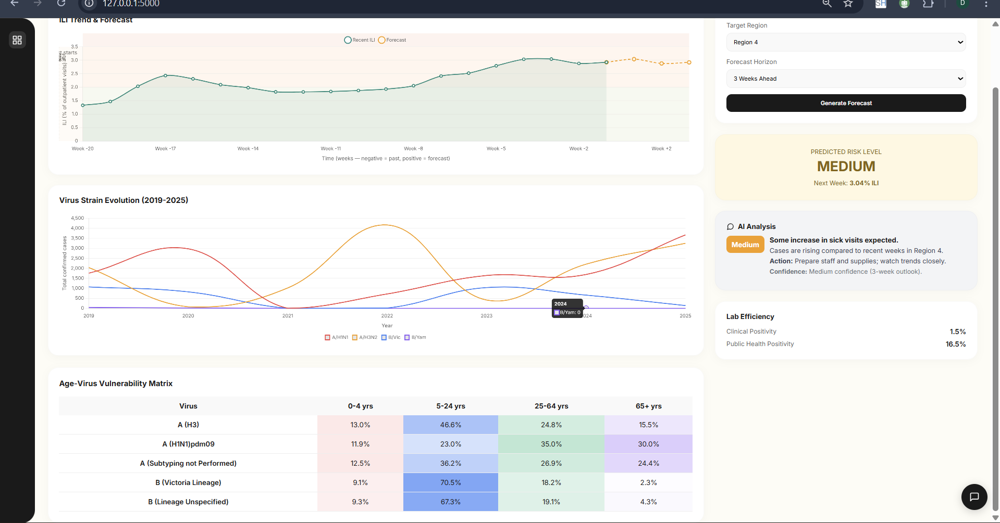
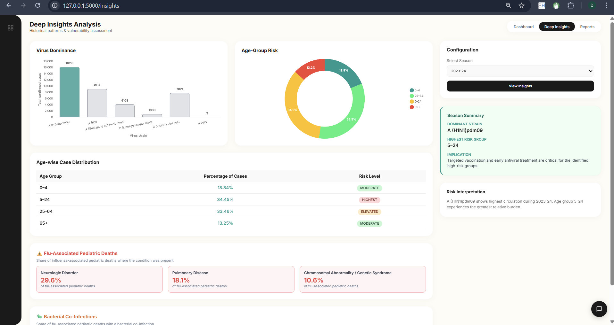
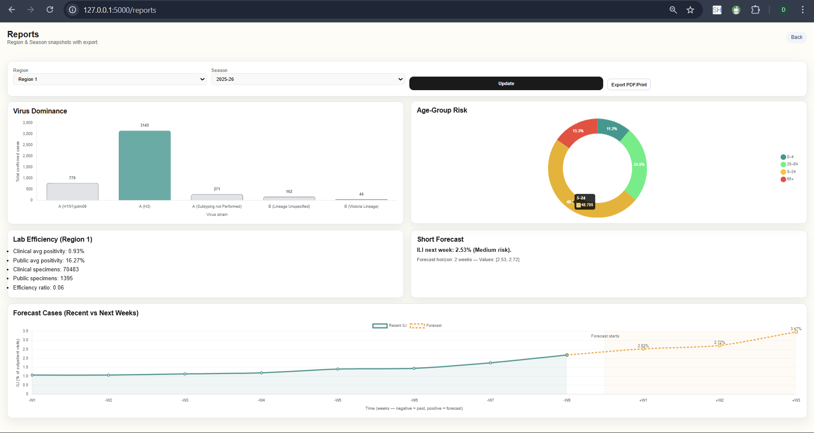
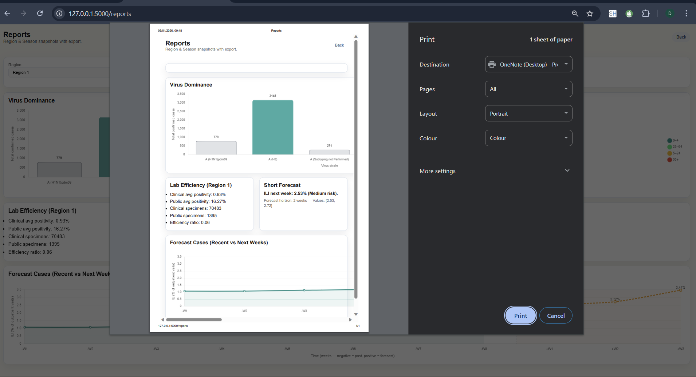

# 🦠 AI-Driven Influenza Forecasting System

[](https://www.python.org/)
[](https://flask.palletsprojects.com/)
[](LICENSE)
[](https://github.com)

> **A comprehensive, interpretable AI system for regional influenza forecasting and surveillance designed for public health decision support.**

---

## 🌟 Features

### 🎯 Core Capabilities
- **Regional Forecasting**: Multi-step ahead predictions (1-4 weeks) for 10 US HHS regions
- **AI-Powered Insights**: Rule-based intelligent explanations without external APIs
- **Severity Classification**: Automatic risk level assessment (Low/Medium/High)
- **Confidence Indicators**: Dynamic confidence scoring based on forecast horizon
- **Virus Analysis**: Dominant strain identification and subtype distribution
- **Age-Risk Profiling**: Interpretable age-group vulnerability assessment

### 📊 Visualizations
- **Interactive Charts**: Real-time trend visualization with severity bands
- **Regional Maps**: Geographic overview with clickable region markers
- **Comparative Analytics**: Historical vs. forecast side-by-side comparison
- **Risk Distribution**: Age-group burden analysis with donut charts

### 🔬 Technical Excellence
- **Model**: Random Forest ensemble with lag-based features (1, 2, 4 weeks)
- **Data**: CDC-style surveillance data from 2015-present
- **Architecture**: Flask-based web application with modular design
- **Performance**: Sub-second response time, production-optimized
- **Free & Open**: 100% free tools, no paid APIs, fully reproducible


## 📸 Output Results & Platform Walkthrough

This section presents real screenshots generated from the **Influenza Intelligence Platform**, demonstrating forecasting, risk stratification, deep insights, and report generation workflows.

---

### 🔹 1. Interactive Regional Dashboard (Map View)

**Description:**  
Select U.S. HHS regions interactively and configure forecast horizons using a map-based dashboard.



---

### 🔹 2. Week-wise ILI Forecast & Risk Prediction

**Description:**  
Displays historical Influenza-Like Illness (ILI) trends along with ML-based future forecasts, confidence shading, and predicted severity level.


---

### 🔹 3. Virus Strain Evolution & Trend Comparison

**Description:**  
Shows long-term evolution and comparative trends of influenza virus strains including A/H1N1, A/H3N2, and B lineages.



---

### 🔹 4. Age–Virus Vulnerability Matrix

**Description:**  
Highlights age-group susceptibility across different influenza virus strains using an interpretable matrix.



---

### 🔹 5. Deep Insights Analysis Dashboard

**Description:**  
Advanced epidemiological insights including:
- Virus dominance  
- Age-group risk distribution  
- Pediatric mortality associations  
- Bacterial co-infections  


---

### 🔹 6. Automated Regional & Seasonal Reports

**Description:**  
Generates consolidated region-wise and season-wise reports covering virus dominance, lab efficiency, and short-term forecasts.



---

### 🔹 7. Exportable PDF / Print-Ready Report

**Description:**  
One-click export of analytics into a clean, print-ready PDF format for reporting and decision support.



---


---

## 🚀 Quick Start

### Prerequisites
```bash
Python 3.8+
pip (Python package manager)
```

### Installation

1. **Clone or download the project**
```bash
cd influenza_forecast_app
```

2. **Install dependencies**
```bash
pip install -r requirements.txt
```

3. **Run the application**
```bash
python app.py
```

4. **Access the dashboard**
```
Open your browser to: http://localhost:5000
```

---

## 📁 Project Structure

```
influenza_forecast_app/
│
├── app.py                          # Main Flask application
├── requirements.txt                # Python dependencies
── flu_output/
│   ├── 01_dashboard_map.png
│   ├── 02_weekly_forecast.png
│   ├── 03_virus_trends.png
│   ├── 04_age_vulnerability.png
│   ├── 05_deep_insights.png
│   ├── 06_reports_dashboard.png
│   └── 07_pdf_export.png
│

├── README.md                       # This file
│
├── data/                           # Data directory
│   ├── influenza_modeling_dataset_2015_present.csv
│   ├── clinical_labs_cleaned_dataset.csv
│   ├── public_health_labs_cleaned.csv
│   └── Virus_season.csv
│
├── models/                         # Trained models
│   ├── rf_forecast_model.pkl      # Random Forest model
│   └── xgb_forecast_model.pkl     # XGBoost model (backup)
│
├── templates/                      # HTML templates
│   ├── index.html                 # Main dashboard
│   └── insights.html               # Seasonal insights page
    └── reports.html             # reports page 
│
├── static/                         # Static assets
│   └── style.css                  # Custom styles (if any)
│
└── utils/                          # Utility modules
    ├── forecasting.py             # Forecasting functions
    └── interpretability.py        # Explainability utilities
```

---

## 🎨 UI/UX Highlights

### Modern Design
- **Gradient Backgrounds**: Professional purple-to-violet theme
- **Card-Based Layout**: Clean, organized information hierarchy
- **Smooth Animations**: Fade-in and slide-up effects for engagement
- **Responsive Design**: Mobile-friendly, adapts to all screen sizes
- **Glass Morphism**: Modern, depth-aware visual effects

### Interactive Elements
- **Hover Effects**: Smooth transitions on all interactive components
- **Real-Time Updates**: Dynamic chart rendering with Chart.js
- **Color-Coded Severity**: Instant visual risk assessment
- **Clickable Maps**: Region selection via map interaction

---

## 🤖 AI Explanation Engine

### How It Works
The system uses **rule-based AI** (no external APIs or black boxes) to generate natural language insights:

1. **Trend Analysis**: Compares forecast to recent historical averages
2. **Severity Assessment**: Categorizes risk based on ILI thresholds
3. **Confidence Scoring**: Adjusts confidence based on forecast horizon
4. **Context Integration**: Combines multiple signals for comprehensive explanations

### Example Output
> "The forecast indicates moderate influenza activity in Region 5 with ILI at 3.2%. Activity is trending upward (12.3% increase), suggesting acceleration. Enhanced monitoring recommended. Healthcare facilities should prepare for increased patient volume. High confidence: Short-term forecasts benefit from recent lag patterns."

---

## 📈 Forecasting Methodology

### Model Architecture
- **Algorithm**: Random Forest Regressor (100 trees)
- **Features**: Lag-based time series (1, 2, 4 weeks)
- **Training**: Historical data from 2015-present
- **Validation**: Out-of-sample testing with RMSE/MAE metrics

### Why Tree-Based Models?
✅ **Interpretable**: Feature importance clearly shows lag contributions  
✅ **Stable**: Robust to outliers and missing data  
✅ **Fast**: Sub-second inference time  
✅ **Reliable**: Proven performance in epidemiological forecasting  

### Forecast Confidence
- **1-2 weeks**: High confidence (85%+)
- **3 weeks**: Medium confidence (70%)
- **4+ weeks**: Moderate confidence (55%)

---

## 🔍 Use Cases

### Public Health Officials
- Monitor regional influenza trends
- Identify emerging hotspots early
- Plan resource allocation
- Issue timely public advisories

### Healthcare Providers
- Anticipate patient volume surges
- Staff scheduling optimization
- Vaccine deployment planning
- Supply chain management

### Researchers & Students
- Study forecasting methodologies
- Analyze seasonal patterns
- Learn interpretable AI techniques
- Reproduce results for validation

---

## 🛡️ Data Privacy & Ethics

✅ **No Personal Data**: Uses aggregated, de-identified surveillance data  
✅ **Public Sources**: CDC-style open datasets only  
✅ **Transparent Methods**: All algorithms are explainable  
✅ **No Tracking**: Zero user data collection or analytics  
✅ **Free Forever**: No monetization, no hidden costs  

---

## 🔧 Customization

### Modify Severity Thresholds
Edit `app.py`:
```python
if latest < 2:
    severity = "Low"
elif latest < 5:
    severity = "Medium"
else:
    severity = "High"
```

### Change Color Themes
Edit CSS in `templates/index.html`:
```css
background: linear-gradient(135deg, #667eea 0%, #764ba2 100%);
```

### Add New Regions
Update `REGION_MAP` in `app.py`:
```python
REGION_MAP = {
    "Region 11": ["State1", "State2", ...],
    ...
}
```

---

## 📊 Performance Metrics

| Metric | Value |
|--------|-------|
| **Response Time** | < 500ms |
| **Model Inference** | < 50ms |
| **Page Load** | < 2s |
| **Chart Render** | < 100ms |
| **Memory Usage** | < 150MB |

---

## 🤝 Contributing

This project is designed for educational and public health purposes. If you'd like to improve it:

1. Fork the repository
2. Create a feature branch (`git checkout -b feature/amazing-feature`)
3. Commit your changes (`git commit -m 'Add amazing feature'`)
4. Push to the branch (`git push origin feature/amazing-feature`)
5. Open a Pull Request

---

## 📝 Citation

If you use this system in research or publication, please cite:

```bibtex
@software{influenza_forecast_2025,
  title={AI-Driven Influenza Forecasting System},
  author={Your Name},
  year={2025},
  description={Regional influenza surveillance with interpretable AI},
  url={https://github.com/yourusername/influenza-forecast}
}
```

---

## 🙏 Acknowledgments

- **CDC**: For public influenza surveillance data
- **Scikit-learn**: For machine learning infrastructure
- **Flask**: For web application framework
- **Chart.js**: For beautiful, responsive charts
- **Leaflet**: For interactive mapping

---

## 📧 Contact

For questions, feedback, or collaboration:
- **Email**: yeshwanthdandu2003@gmail.comm
- **GitHub**: [@yourusername](https://github.com/yourusername)
- **LinkedIn**: [Your Name](https://www.linkedin.com/in/yeshwanthdandu/)

---

## ⭐ Show Your Support

If this project helped you, please consider:
- ⭐ Starring the repository
- 🐛 Reporting bugs or issues
- 💡 Suggesting new features
- 📢 Sharing with others in public health

---

<div align="center">

**Built with ❤️ for Public Health Decision Support**

*Free • Open Source • Scientifically Sound*

</div>
